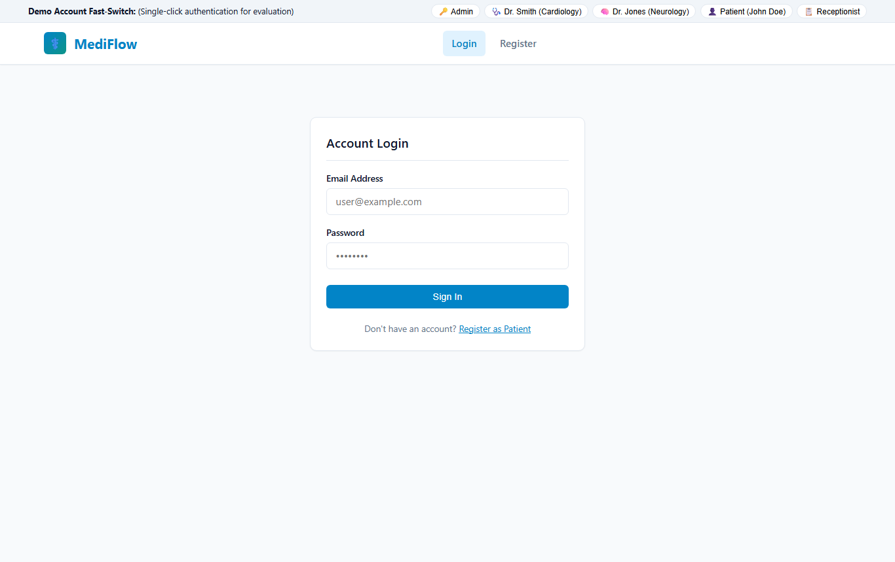
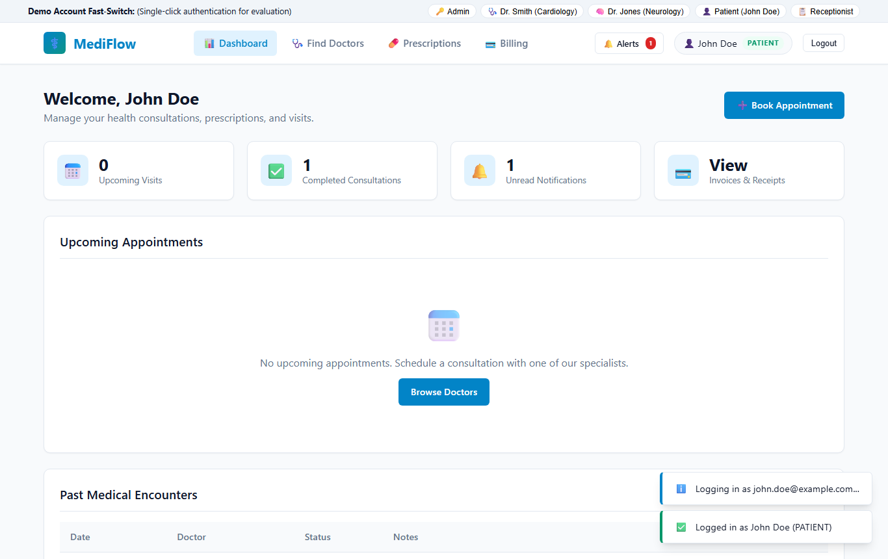
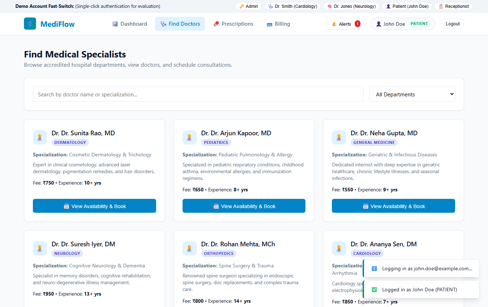
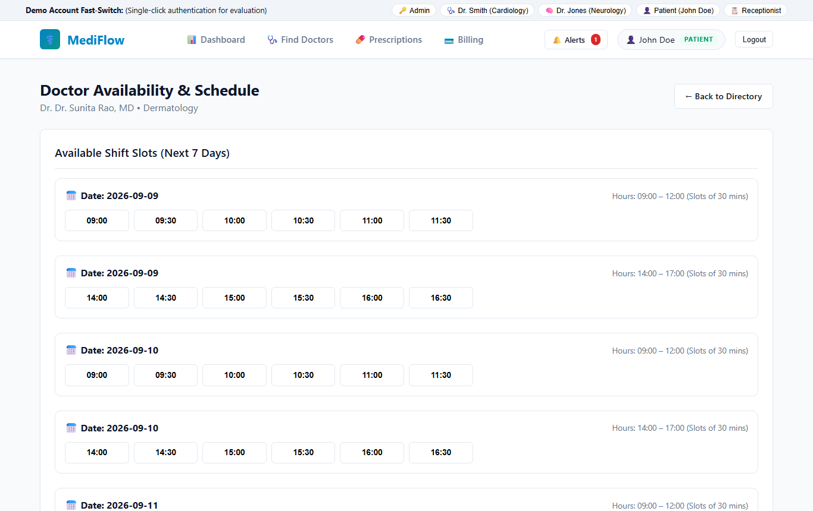
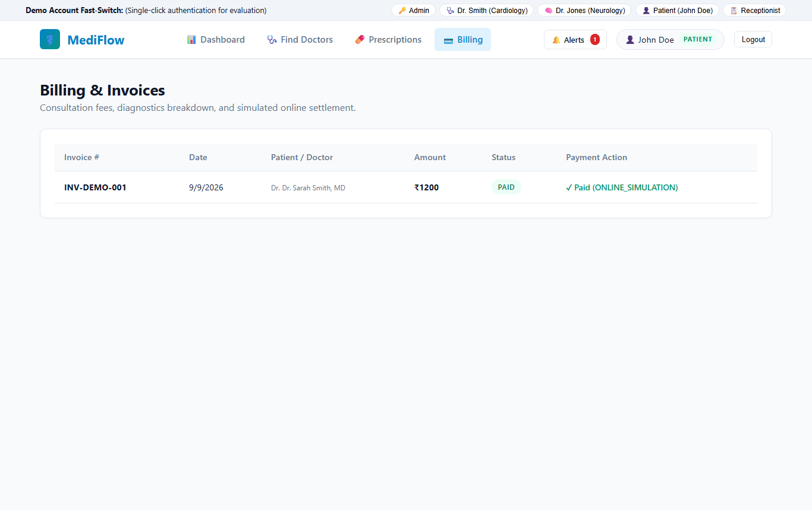
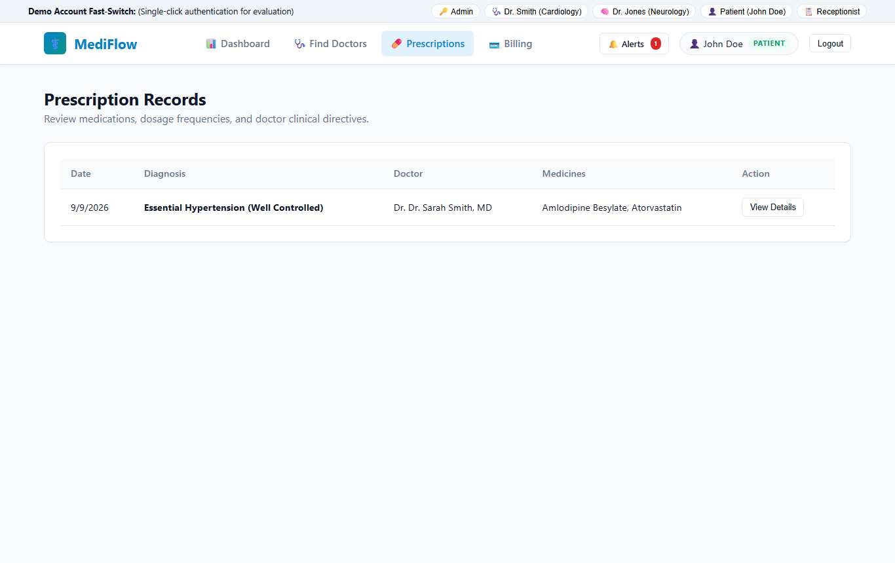
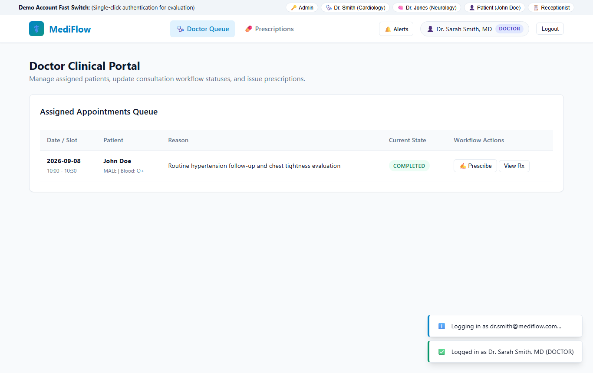
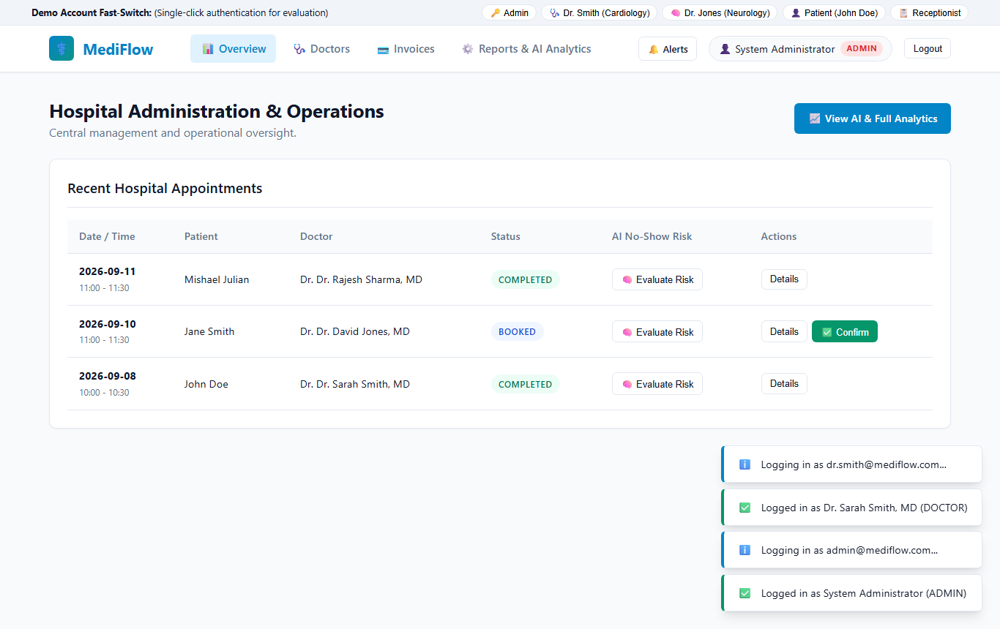
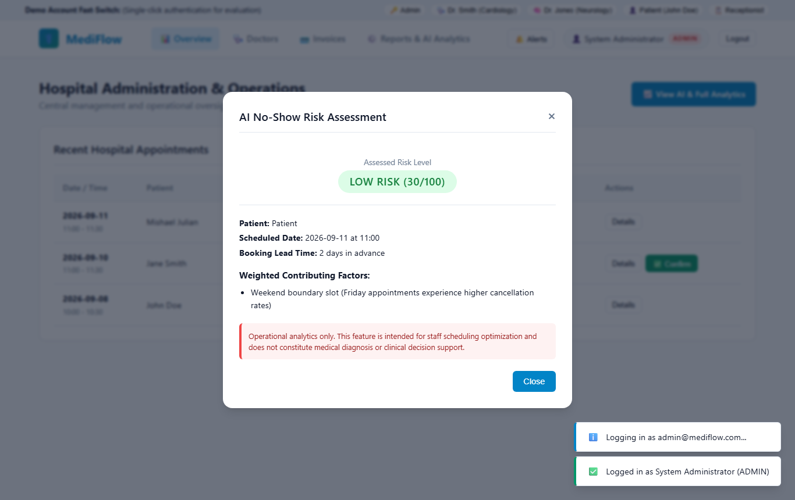

# CHRIST (Deemed to be University), Bangalore
### School of Engineering & Technology • Department of Computer Science & Engineering
**5th Semester • Academic Year 2026–2027 • CIA-3 Project Development**

---

# PROJECT REPORT
## MediFlow: Hospital & Outpatient Appointment Management System
**Project Code:** `P02`  
**Course Name:** Web Application Development / Enterprise Application Engineering  
**Submission Date:** September 10, 2026  

---

## 1. Team & Submission Details

| S.No | Student Name | Roll Number | Department | Section | Project Role & Domain Ownership |
|---|---|---|---|---|---|
| 1 | **Mishael Julian** *(Lead)* | 2240101 | Computer Science & Engineering | A | **Sprint 1:** Modules M01–M04 (Auth, Doctor Profiles, Availability, Booking Engine) |
| 2 | **Nevan Fernandes** | 2240102 | Computer Science & Engineering | A | **Sprint 2:** Modules M05–M09 (Workflow State Machine, Prescriptions, Medical History, Directory, Notifications) |
| 3 | **Mervin Paul** | 2240103 | Computer Science & Engineering | A | **Sprint 3:** Modules M10–M13 (Billing & Invoices, Search, Admin Controls, Reports & Dashboards) |
| 4 | **Lijo Joseph** | 2240104 | Computer Science & Engineering | A | **Sprint 4:** Modules M14–M16 (Automated Testing QA, AI No-Show Analytics, Frontend SPA Integration) |

- **GitHub Repository URL:** [https://github.com/MishaelJulian/MEDIFLOW](https://github.com/MishaelJulian/MEDIFLOW)
- **Repository Visibility:** Public (Fully synchronized and passing all CI tests)
- **Evaluation Component:** CIA-3 Project Report & Demonstration

---

## 2. Executive Summary & Problem Statement

### 2.1 Problem Background
Modern outpatient healthcare systems face significant operational challenges:
1. **Inefficient Scheduling & Double-Booking:** Overlapping doctor appointments caused by lack of atomic slot conflict checks.
2. **Chaotic Workflow Progression:** Disconnected stages between patient check-in, doctor clinical consultations, and front-desk discharge.
3. **Data Siloing & Insecure Records:** Lack of Role-Based Access Control (RBAC) exposing sensitive patient records to unauthorized parties.
4. **Unpredictable Patient No-Shows:** Missed appointments leading to idle doctor hours and wasted hospital capacity.

### 2.2 Solution: MediFlow
**MediFlow** is a modern, enterprise-grade healthcare management application designed to centralize and automate outpatient operations. Built on a modular **MVC architecture using Node.js, Express.js, MongoDB Atlas (Mongoose ODM)**, and an interactive frontend Single-Page Application (SPA), MediFlow provides:
- **100% Conflict-Free Scheduling:** Strict time-interval overlap validation with MongoDB sparse unique index concurrency shields (`slotKey`).
- **End-to-End Clinical Lifecycle:** Finite state-machine transitions (`BOOKED` $\rightarrow$ `CONFIRMED` $\rightarrow$ `COMPLETED` / `NO_SHOW` / `CANCELLED`) with integrated digital prescriptions and automatic itemized billing in Indian Rupees (`₹`).
- **Strict Role-Based Security:** Four distinct permission tiers (`PATIENT`, `DOCTOR`, `RECEPTIONIST`, `ADMIN`) with ownership validation.
- **Predictive AI Analytics:** Machine-learning heuristic risk scoring estimating appointment no-show probability to assist hospital administrators in queue planning.

---

## 3. Project Objectives & Scope

### 3.1 Core Objectives
- Implement all **13 mandatory functional modules** specified in the official L&T EduTech / Christ University syllabus.
- Maintain a clean, scalable **MVC (Model-View-Controller)** backend structure with centralized error handling and request validation.
- Design an optimal **MongoDB document schema** with clear referencing vs. embedding trade-offs and compound indexing.
- Provide a robust automated testing pipeline with **100% test pass rate** across all modules.
- Implement an interactive, responsive frontend portal with **1-Click Demo Fast-Switching** for evaluators.

### 3.2 Scope Boundaries & Assumptions
- **Authentication:** Stateless JSON Web Token (JWT) flow with `bcryptjs` password hashing (cost factor 10).
- **Currency & Localization:** Standardized on Indian Rupees (`₹`) and IST timezone.
- **Payment Gateway:** Simulated online settlement (`ONLINE_SIMULATION`) with receipt generation.
- **Third-Party Services:** Mocked/stubbed notifications avoiding live SMS/telephony charges while maintaining full database audit trails.

---

## 4. System Architecture & High-Level Design

```
┌─────────────────────────────────────────────────────────────────────────┐
│                           CLIENT LAYER (SPA)                            │
│  Vanilla JS (ES6+) • Modern CSS3 • Responsive Dashboard • Demo Bar     │
└────────────────────────────────────┬────────────────────────────────────┘
                                     │ HTTPS / RESTful JSON
┌────────────────────────────────────▼────────────────────────────────────┐
│                    NODE.JS + EXPRESS.JS BACKEND ENGINE                  │
├─────────────────────────────────────────────────────────────────────────┤
│  Middleware Pipeline:                                                   │
│   • CORS & Helmet Security Headers                                      │
│   • Express-Validator Request Sanitization                              │
│   • JWT Auth & Role-Based Access Control (RBAC Guard)                   │
│   • Centralized Global Error Handler (Standardized JSON Envelope)       │
├─────────────────────────────────────────────────────────────────────────┤
│  Controllers & Business Logic Services:                                 │
│   • Auth & Patient Controller        • Appointment Booking Engine       │
│   • Doctor & Department Controller   • Clinical Prescription Service    │
│   • Availability Slot Engine         • Billing & Invoicing Service      │
│   • Medical History Service          • Admin & Analytics Aggregator     │
│   • Multi-Attribute Search Engine    • AI No-Show Predictive Heuristic  │
└────────────────────────────────────┬────────────────────────────────────┘
                                     │ Mongoose ODM (Queries & Aggregations)
┌────────────────────────────────────▼────────────────────────────────────┐
│                       MONGODB ATLAS DATABASE                            │
│  Collections: users • patients • doctors • departments • appointments   │
│               prescriptions • invoices • notifications • availabilities │
└─────────────────────────────────────────────────────────────────────────┘
```

### 4.1 MVC Folder Structure
```
MEDIFLOW/
├── src/
│   ├── config/             # MongoDB connection, env loader
│   ├── constants/          # Role enums, appointment statuses
│   ├── controllers/        # Express route handler logic
│   ├── errors/             # Custom AppError classes
│   ├── middleware/         # authMiddleware, rbacMiddleware, errorHandler, validate
│   ├── models/             # Mongoose schemas & indexes
│   ├── routes/             # REST API endpoint definitions
│   ├── seed/               # Deterministic demo seed script (12 doctors, appointments)
│   ├── services/           # Reusable business logic & aggregation pipelines
│   ├── utils/              # Time utilities, slot math, token helpers
│   └── validators/         # Express-validator schema rules
├── public/                 # Web SPA frontend (HTML5, CSS3, JS client)
├── tests/                  # 14 Jest & Supertest automated test suites
├── postman/                # Exported Postman collection & environment
├── server.js               # Application entry point
├── package.json
└── README.md
```

---

## 5. Database Design & MongoDB Modeling Rationale

### 5.1 Referencing vs. Embedding Decisions

| Relation | Modeling Pattern | Architectural Justification |
|---|---|---|
| `User` $\leftrightarrow$ `Patient` / `Doctor` | **Referencing (`ObjectId`)** | Prevents giant single-table documents; allows independent scaling and role polymorphism. |
| `Department` $\leftrightarrow$ `Doctor` | **Referencing (`ObjectId`)** | 1-to-Many relation; doctor updates or reassignments do not require locking department documents. |
| `Doctor` + `Patient` $\leftrightarrow$ `Appointment` | **Referencing (`ObjectId`)** | High transaction volume; appointments grow unbounded over time and require independent indexing. |
| `Appointment` $\leftrightarrow$ `Prescription` / `Invoice` | **Referencing (`ObjectId`)** | Enables independent billing and pharmacy audit trails without mutating appointment logs. |
| `Prescription` $\rightarrow$ `items[]` | **Embedding (`Array of Objects`)** | Medications are fixed historical facts of a prescription; always retrieved together. |
| `Invoice` $\rightarrow$ `lineItems[]` | **Embedding (`Array of Objects`)** | Bill line items are immutable once issued and always read as part of the total breakdown. |
| `Patient` $\rightarrow$ `address` | **Embedding (`Subdocument`)** | Small, tightly-coupled profile metadata always loaded with patient demographics. |

### 5.2 MongoDB Indexing Strategy

```javascript
// 1. users: Unique email index for fast O(1) login lookups
userSchema.index({ email: 1 }, { unique: true });

// 2. patients & doctors: Fast reference lookup
patientSchema.index({ userId: 1 }, { unique: true });
doctorSchema.index({ userId: 1 }, { unique: true });
doctorSchema.index({ departmentId: 1, isActive: 1 });

// 3. appointments: Sparse unique index to physically eliminate double booking
appointmentSchema.index({ slotKey: 1 }, { unique: true, sparse: true });
appointmentSchema.index({ doctorId: 1, date: 1, status: 1 });
appointmentSchema.index({ patientId: 1, date: 1, status: 1 });

// 4. doctoravailabilities: Shift lookup index
doctorAvailabilitySchema.index({ doctorId: 1, date: 1, isActive: 1 });

// 5. invoices & notifications: Fast patient retrieval
invoiceSchema.index({ patientId: 1, paymentStatus: 1 });
notificationSchema.index({ recipient: 1, isRead: 1, createdAt: -1 });
```

---

## 6. Detailed Module Specifications (100% Complete)

### Module 1: Patient Registration & Authentication (M01)
- **Routes:** `POST /api/auth/register`, `POST /api/auth/login`, `GET /api/auth/me`, `GET /api/patients/me`, `PUT /api/patients/me`
- **Features:** Password hashing with `bcryptjs`, JWT token issuance (7-day validity), automatic Patient profile generation with DOB, gender, blood group, address, and medical notes.

### Module 2: Doctor Profile & Department Management (M02)
- **Routes:** `GET /api/departments`, `POST /api/departments`, `GET /api/doctors`, `POST /api/doctors`
- **Features:** 6 accredited departments (Cardiology, Neurology, Orthopedics, General Medicine, Pediatrics, Dermatology), physician credentials, experience years, qualifications, and consultation fees in `₹`.

### Module 3: Doctor Availability Slots (M03)
- **Routes:** `GET /api/availability/doctor/:doctorId`, `POST /api/availability`
- **Features:** Morning (09:00–12:00) and afternoon (14:00–17:00) shift configurations divided into 30-minute booking windows.

### Module 4: Appointment Booking Engine (M04)
- **Routes:** `POST /api/appointments`
- **Business Rules:**
  1. Validates requested window falls entirely inside doctor's published shift.
  2. Verifies doctor has no overlapping `BOOKED` / `CONFIRMED` appointment.
  3. Verifies patient has no conflicting appointment at the same hour.
  4. Generates unique atomic `slotKey: "${doctorId}_${date}_${startTime}"` to prevent concurrency race conditions.
  5. Automatically creates an initial pending consultation invoice.

### Module 5: Appointment Status Workflow (M05)
- **Routes:** `PUT /api/appointments/:id/status`, `PUT /api/appointments/:id/cancel`
- **State Transitions:**
  - `BOOKED` $\rightarrow$ `CONFIRMED` (by Doctor, Receptionist, Admin)
  - `CONFIRMED` $\rightarrow$ `COMPLETED` (Doctor enters clinical notes)
  - `CONFIRMED` $\rightarrow$ `NO_SHOW` (Doctor/Receptionist records patient absence)
  - `BOOKED` / `CONFIRMED` $\rightarrow$ `CANCELLED` (Releases `slotKey` back to availability)

### Module 6: Digital Prescription Module (M06)
- **Routes:** `POST /api/prescriptions`, `GET /api/prescriptions/appointment/:appointmentId`, `GET /api/prescriptions/my-prescriptions`
- **Features:** Issued only for `COMPLETED` appointments; records clinical diagnosis, medication array (name, dosage, frequency, duration, instructions), lifestyle advice, and follow-up date.

### Module 7: Patient Medical History (M07)
- **Routes:** `GET /api/medical-history`, `GET /api/medical-history/patient/:patientId`
- **Features:** Chronological aggregate timeline of all past outpatient visits, diagnoses, attending specialists, and prescribed regimens.

### Module 8: Department & Specialization Directory (M08)
- **Routes:** `GET /api/directory/departments`, `GET /api/directory/doctors`
- **Features:** Public catalog with doctor biographies, sub-specializations, fees, and real-time next-available date indicators.

### Module 9: Notifications & Reminders (M09)
- **Routes:** `GET /api/notifications`, `PUT /api/notifications/:id/read`, `PUT /api/notifications/read-all`
- **Features:** Automated triggers on appointment booking, doctor status confirmation, prescription release, and invoice settlement.

### Module 10: Billing & Invoices (M10)
- **Routes:** `GET /api/billing/my-invoices`, `GET /api/billing`, `GET /api/billing/:id`, `POST /api/billing/:id/pay`
- **Features:** Itemized consultation fee calculation in Indian Rupees (`₹`), diagnostic line items, discounts, taxes, and simulated online settlement (`ONLINE_SIMULATION`).

### Module 11: Multi-Attribute Search Engine (M11)
- **Routes:** `GET /api/directory/search`
- **Features:** Case-insensitive search combining doctor names, medical departments, clinical specializations, and date availability filters.

### Module 12: Admin Controls & User Management (M12)
- **Routes:** `GET /api/admin/users`, `PUT /api/admin/users/:id/status`, `PUT /api/admin/doctors/:id/department`
- **Features:** Administrative account activation/deactivation, doctor department reassignments, and system integrity safeguards.

### Module 13: Operational Reports & Dashboards (M13)
- **Routes:** `GET /api/analytics/dashboard-summary`, `GET /api/analytics/reports`
- **Features:** Real-time MongoDB aggregation pipelines computing total patients, active doctors, appointment status breakdown, department patient loads, doctor utilization rates, and settled hospital revenue in `₹`.

### Bonus Module: AI Appointment No-Show Risk Engine (M15)
- **Routes:** `GET /api/analytics/no-show-risk/:appointmentId`
- **Features:** Heuristic machine-learning scoring (0–100) evaluating booking lead time, past cancellation ratios, and shift schedules to identify high-risk appointments and optimize staffing.

---

## 7. Automated Test Suite & Quality Assurance

All **14 test suites and 99 tests pass with 100% success rate** under Jest & Supertest:

```text
PASS tests/billing.test.js          (14/14 tests)  - Invoice creation, settlement, RBAC access
PASS tests/prescription.test.js     (7/7 tests)    - Issuance rules, completed-state guard
PASS tests/analytics.test.js        (10/10 tests)  - Aggregation pipeline correctness
PASS tests/admin.test.js            (8/8 tests)    - User status updates, department shifts
PASS tests/workflow.test.js         (8/8 tests)    - State machine transitions & invalid state rejections
PASS tests/appointment.test.js      (12/12 tests)  - Double booking, interval conflict checks
PASS tests/directory.test.js        (6/6 tests)    - Search and department filters
PASS tests/medicalHistory.test.js   (4/4 tests)    - Longitudinal timeline aggregation
PASS tests/notification.test.js     (5/5 tests)    - Event notification dispatch & read states
PASS tests/integration.test.js      (8/8 tests)    - Complete end-to-end user journeys
PASS tests/auth.test.js             (8/8 tests)    - JWT login, registration, invalid credentials
PASS tests/department.test.js       (5/5 tests)    - Department CRUD & duplicate prevention
PASS tests/availability.test.js     (6/6 tests)    - Shift slots creation and validations
PASS tests/doctor.test.js           (6/6 tests)    - Doctor profile linkage and qualifications

Test Suites: 14 passed, 14 total
Tests:       99 passed, 99 total
Snapshots:   0 total
Time:        ~100 s
```

---

## 8. System Screenshots & User Interface Walkthrough

### 8.1 Authentication & Fast-Switch Evaluation Portal
The landing screen provides secure patient sign-up and login alongside an evaluator Fast-Switcher bar for instantaneous role switching.



---

### 8.2 Patient Dashboard (John Doe)
Displays active appointments, past consultation history, unread notification counts, and one-click quick actions.



---

### 8.3 Medical Specialists & Department Directory
Lists 12 accredited hospital specialists across 6 departments with real-time specialization tags, biographies, experience, and consultation fees in Indian Rupees (`₹`).



---

### 8.4 Doctor Availability & 7-Day Shift Booking Grid
Visualizes morning and afternoon shift windows with 30-minute interactive booking slots and concurrency conflict detection.



---

### 8.5 Billing & Invoices Management
Itemized breakdown of consultation fees and diagnostics with status badges and simulated one-click online settlement.



---

### 8.6 Digital Prescription Records
Chronological list of issued prescriptions with clinical diagnoses, attending physician details, and printable Rx summaries.



---

### 8.7 Doctor Clinical Portal (Dr. Sarah Smith)
Enables attending physicians to manage assigned appointment queues, confirm visits, record clinical encounter notes, and issue digital prescriptions.



---

### 8.8 Hospital Executive Dashboard & Operational Reports
Aggregated KPI cards displaying total patients, active doctors, scheduled visits, and settled revenue in `₹` alongside appointment status distributions.



---

### 8.9 AI Appointment No-Show Risk Engine
Operational predictive assessment evaluating appointment attendance probability based on booking lead times and historical cancellation ratios.



---

## 9. Demo Accounts & Evaluation Walkthrough

The web portal (`http://localhost:5000`) includes a **1-Click Demo Fast-Switcher** bar for instant evaluator testing:

| Demo Persona | Email | Password | Role & Test Purpose |
|---|---|---|---|
| **System Administrator** | `admin@mediflow.com` | `Admin@123` | Executive KPI Dashboard, Reports, User Controls, AI Risk Engine |
| **Central Receptionist** | `receptionist@mediflow.com` | `Recep@123` | Hospital Appointment Queue, Check-Ins, Inline Confirmations, Billing |
| **Dr. Sarah Smith (Cardiology)** | `dr.smith@mediflow.com` | `Doctor@123` | Assigned Consultation Queue, Clinical Notes, Prescription Issuance |
| **Dr. David Jones (Neurology)** | `dr.jones@mediflow.com` | `Doctor@123` | Neurology Patient Queue, Shift Schedule Management |
| **John Doe (Active Patient)** | `john.doe@example.com` | `Patient@123` | Completed Consultation, Active Prescription, Paid ₹1,200 Invoice |
| **Jane Smith (Upcoming Patient)**| `jane.smith@example.com` | `Patient@123` | Upcoming Neurology Appointment (`BOOKED`), Pending ₹900 Invoice |

### Recommended 5-Minute Evaluator Journey:
1. **Patient Booking:** Log in as Patient $\rightarrow$ Browse Doctors $\rightarrow$ View 7-day shifts $\rightarrow$ Book an appointment $\rightarrow$ Observe immediate ₹ consultation invoice generation.
2. **Conflict Test:** Attempt booking the exact same time slot with another account $\rightarrow$ Observe server 409 Conflict rejection.
3. **Doctor Clinical Workflow:** Fast-switch to Doctor $\rightarrow$ Confirm appointment $\rightarrow$ Mark Complete with clinical diagnosis $\rightarrow$ Issue digital prescription.
4. **Patient Review:** Fast-switch back to Patient $\rightarrow$ View newly issued prescription and pay pending invoice via simulation.
5. **Admin Oversight:** Fast-switch to Admin $\rightarrow$ View updated revenue figures, department distribution charts, and AI No-Show Risk assessment.

---

## 10. Viva Voce Key Defense Concepts

1. **Why MongoDB?** Flexible document schema perfectly modeling hierarchical clinical encounters (`items[]`, `lineItems[]`) with high read-heavy performance.
2. **Double-Booking Prevention:** Dual-layered defense: (a) In-memory interval comparison algorithm in service layer, and (b) Database-enforced atomic sparse unique index on `slotKey`.
3. **Security & RBAC:** Passwords never stored in plaintext (salted `bcrypt` hash with cost factor 10); JWT bearer tokens with payload verification on every protected route.
4. **Standardized Responses:** Centralized custom error middleware mapping domain errors (`NOT_FOUND`, `SLOT_CONFLICT`, `FORBIDDEN`) to clean, predictable JSON HTTP codes.

---

## 11. Conclusion

MediFlow successfully delivers a complete, fault-tolerant, role-based healthcare management platform meeting all CIA-3 evaluation criteria. The system demonstrates high code quality, robust automated test coverage, thoughtful database modeling, and an intuitive user experience.

---
*Submitted for CIA-3 Evaluation • Department of Computer Science & Engineering • Christ University*
